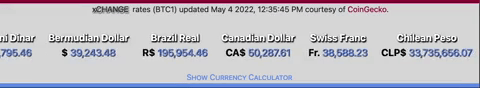

#  **MIT xCHANGE** | BadBank Project 

 ***Try Demo:*** [https://codetracklift.github.io/xchange/](https://codetracklift.github.io/xchange/)

    The development timeframe for this React App was about 2 weeks.  This project was completed about 6 months into myCodingJourney.

>**Skills Utilized**:
<ol>
    <li>Languages: HTML, CSS, JavaScript</li>
    <li>Mobile first and responsive design</li>
    <li>React Hooks: useState, useEffect, useContext</li>
    <li>Axios, Bootstrap, Formik, ReactRouter, ScrollMagic</li>
    <li>API fetch and dynamic component rendering</li>
    <li>Entry validation with error handling</li>
    <li>Local and session storage</li>
</ol>

## About
This is the MIT xPRO Full Stack Coding Bootcamp Front End Project, starter code was provided. 

The project is a functional, fully responsive, and mobile first web application that allows users to create, edit, and delete their own bank accounts.

> Project Requirements:

<ol>
    <li>Navigation Bar</li>
    <ul>
        <li>Routes to: Home, Account, Deposit, Withdraw, User Data </li>
        <li>Styled with Bootstrap, shows current active page</li>
        <li>Hover effects and pop-up with brief description</li>
    </ul>
    <li>Home Page</li>
    <ul>
        <li>Includes bank title, image, and welcome message</li>
    </ul>
    <li>Account Page</li>
    <ul>
        <li>Includes a form on a Bootstrap card</li>
        <li>Form has input fields: name, email, password, and create account button</li>
        <li>Entry validation: blank fields, password < 8 characters</li>
        <li>Submit button is disabled if inputs are blank</li>
        <li>User is notified of successfully account creation or input error</li>
    </ul>
    <li>Deposit and Withdraw Pages</li>
    <ul>
        <li>Include a form on a Bootstrap card showing user balance</li>
        <li>Form has an input field: amount and submit button</li>
        <li>Entry validation: not a number, negative numbers, overdraft protection</li>
        <li>Submit button is disabled if input is blank</li>
        <li>User is notified of successfully transaction or input error</li>
    </ul>
    <li>User Data Page</li>
    <ul>
        <li>Inclues a styled Bootstrap card</li>
        <li>User data is displayed on the card instead of JSON format</li>
    </ul>
</ol>

> Custom Functional Elements:

<ol>
    <li>Fetch currency exchange data from CoinGecko.com API</li>
    <li>Pop-up currency calculator with today's rates</li>
    <li>Currency calculator has error handling</li>
    <li>'Mock' back-end database using local and session storage</li>
    <li>User login and credential validation with error handling</li>
    <li>Transaction history and optional transaction notes</li>
    <li>User data reset button to clear cookies</li>
</ol>

> Custom Design Elements:

<ol>
    <li>Customized images, logos, and icons</li>
    <li>CSS animations and Transitions</li>
    <li>Mobile QR code</li>
    <li>'JS Stock Ticker' displaying current exchange rates</li>
    <li>Simulated business footer with animated elements and social links</li>
    <li>Free productivity apps, a limited time special offer!</li>
</ol>

## How to Run

> Account Management & User Data

Users can create a new account or log into an existing account on the Account page.  User data is stored in local storage and session storage, cookies can be reset on the User Data Page.

> Deposits and Withdrawals

Once logged in, users can make transactions on the respective pages.  The app will validate the user's input and notify the user of any errors.

> Currency Calculator & Exchange Rates

API data is fetched from CoinGecko.com upon page load. The app will display the current exchange rates for today's date.  The user can use the currency calculator to convert between currencies.

> Dependencies

React, Axios, Bootstrap, Formik, ReactRouter, ScrollMagic

## Future Roadmap

- [x] Add a 'mock' back-end database
- [x] Add a user login
- [x] Add transactions to context
- [x] Render transaction history
- [x] Fetch API data from CoinGecko.com
- [x] Render API data on page
- [x] Develop a 'stock ticker'
- [x] Develop a 'currency calculator'
- [x] Add design elements to simulate a business footer

## MIT License

Copyright (c) 2022 Pete Chu  ***[codeByPete](https://www.codebypete.com/)***

Permission is hereby granted, free of charge, to any person obtaining a copy of this software and associated documentation files (the "Software"), to deal in the Software without restriction, including without limitation the rights to use, copy, modify, merge, publish, distribute, sublicense, and/or sell copies of the Software, and to permit persons to whom the Software is furnished to do so, subject to the following conditions:

The above copyright notice and this permission notice shall be included in all copies or substantial portions of the Software.

THE SOFTWARE IS PROVIDED "AS IS", WITHOUT WARRANTY OF ANY KIND, EXPRESS OR IMPLIED, INCLUDING BUT NOT LIMITED TO THE WARRANTIES OF MERCHANTABILITY FITNESS FOR A PARTICULAR PURPOSE AND NONINFRINGEMENT. IN NO EVENT SHALL THE AUTHORS OR COPYRIGHT HOLDERS BE LIABLE FOR ANY CLAIM, DAMAGES OR OTHER LIABILITY, WHETHER IN AN ACTION OF CONTRACT, TORT OR OTHERWISE, ARISING FROM, OUT OF OR IN CONNECTION WITH THE SOFTWARE OR THE USE OR OTHER DEALINGS IN THE SOFTWARE.